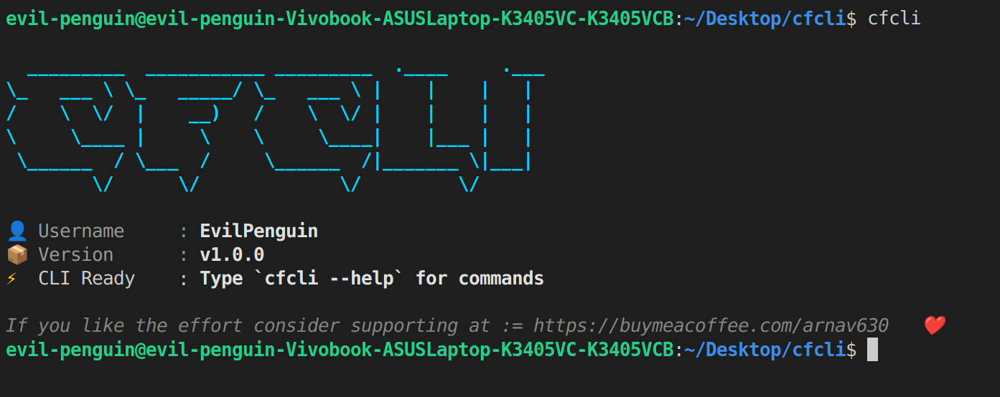

# CFCLI

A simple terminal-based CLI tool to interact with [Codeforces](https://codeforces.com/) data.  
Currently **(under construction) NOT WORKING ON IT CURRENTLY** with a few working commands.

---

## Features (Implemented)

- **Profile**  
  Fetch and display basic profile details of a Codeforces user.  
  ```bash
  cfcli profile <username>
  ```

- **Stock**  
  Show the last solved problem of a user (problem name, rating, and submission time).  
  ```bash
  cfcli stock <username>
  ```

- **Set Username**  
  Set a reference username so you don’t have to pass it every time.  
  ```bash
  cfcli set username <your_username>
  ```

---

## Planned Features

- **Analysis**  
  Commands for analyzing contests, problems, and user activity.  
  (Not implemented yet)

---

## Installation

Clone the repository and build:

```bash
git clone https://github.com/yourusername/cfcli.git
cd cfcli
go build -o cfcli
```

You can then run `./cfcli` or move it to your PATH for global usage.

---

## Usage Examples

```bash
# View a user's profile
cfcli profile tourist

# Get last solved problem
cfcli stock tourist

# Save a default username
cfcli set username tourist
```

---

## Demo



---

## Status

⚠️ This project is in its early stages. Expect frequent changes and improvements.

---

## License

MIT License
